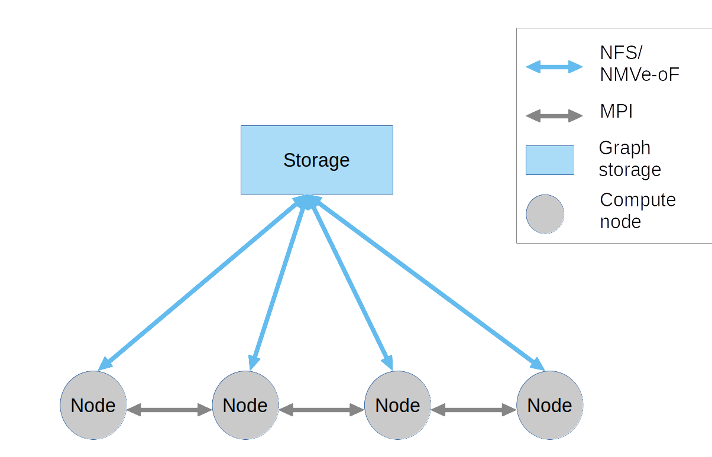

# dgraph_scaler
Graph dataset scaler that receives an input graph and it scales up or down by any arbitrary factor.

## System architecture
	
The system presents a flat architecture, where all the nodes are homogeneous in configuration and resources. 
There is no hierarchy. This way, unnecessary complexities in the programming model are avoided. 
Any node can communicate with any other node. For communication the MPI library is used. 
This way, the nodes do not need to take care of naming, discovery or higher-level multiplexing abstractions and logic.



## Usage
In order to use the program with MPI the following command is used:

```console
foo@bar:~$ mpirun -np 2 python3.5 main.py datasets/graph.txt  samples/graph 6.5 -v
```

There are many scaling options. You can check them by running:

```console
foo@bar:~$ python3.5 main.py --help
```
